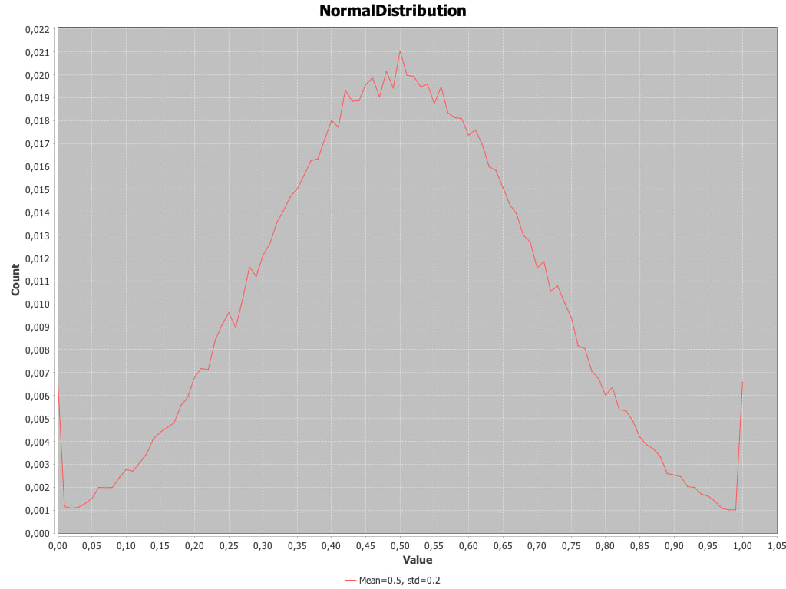

# Система снаряжения

Текущая система построена так, что каждый предмет уникален.

## Генерация предмета
У каждого предмета есть основа - объект. Каждый объект занимает определённые слоты у персонажа.
[Файл с объектами](../src/main/resources/game-data/item_objects.toml).

В предмете может быть до двух модификаторов.
[Файл с модификаторами](../src/main/resources/game-data/item_modifiers.toml)

Все объекты и модификаторы обладают определёнными характеристиками, из которых получается итоговый объект.
Характеристики из диапазона получаются в соответствии с данным распределением:

Суть в том, чтобы максимальные и минимальные значения генерировались реже, чем средние.

## Способы получения предмета

1. В результате успешного рейда персонаж может обнаружить предмет
